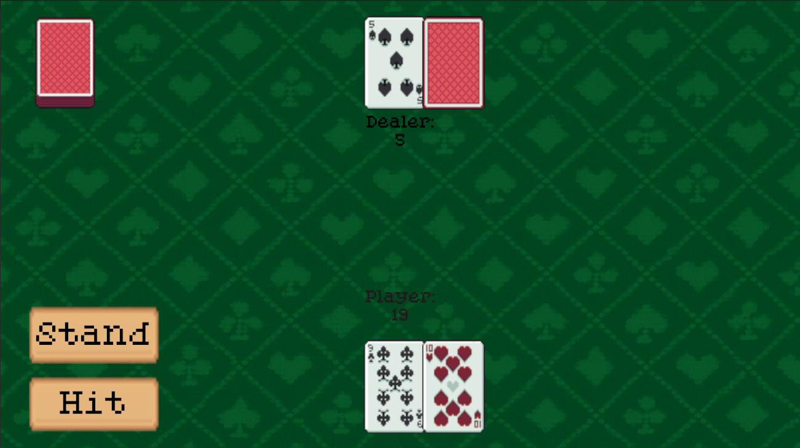

# ♠️ Blackjack

A simple **Blackjack** card game made with **Unity** and **C#**, built as part of my journey to learn game development.  
It’s a lightweight project that focuses on game logic, UI handling, and core Unity scripting. 🚨<ins>**Important:**</ins> This is a pre-release version of my Blackjack game, created to practice and improve my C# and Unity skills. It’s not the full game yet, I’m still developing it and plan to add more features soon!

---

## 🎮 Gameplay

- Try to get as close to **21** as possible without going over.
- You play against the **dealer**.
- Each round:
  - Press **Hit** to draw a card.
  - Press **Stand** to keep your current hand.
  - Dealer reveals their cards and plays automatically.
- The game declares the winner at the end of each round.

---

## 🧱 Built With

- **Unity Editor 6.2**
- **C# (Visual Studio 2022)**
- Basic Unity UI Components (Buttons, Text, Canvas)

---

## 🧠 Purpose

This game was made for **learning and practice** — to understand:
- How to manage game states in Unity
- Basic card game logic
- Using UI elements and event systems
- Writing clean, reusable C# scripts

---

## 🚧 Planned Features

- Chip system 💎

- Level progression 🪜

- Split ✂️ and Surrender 🏳️ options

This early build is mainly for learning and testing, the actual full game will come later

---

## 🕹️ How to Play

1. Download the latest build from the [Releases](https://github.com/yamakyusuf4/Flabby-Birb/releases/tag/v0.4) page.
2. Unzip the file.
3. Run `Blackjack.exe` (or the version for your OS).
4. Enjoy a quick round of digital Blackjack!
